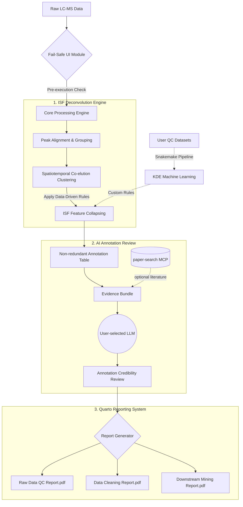

# MetMiner V2: Robust Plant Metabolomics, Feature Networks, and AI-Assisted Annotation Review

[](#)
[](#)
[](#)

**MetMiner V2** is a next-generation, open-source R platform designed to address the most critical bottlenecks in untargeted LC-MS metabolomics: high false-positive rates caused by in-source fragmentation (ISF), feature redundancy, workflow fragility, and weak biological context in spectral annotation.

V2 combines a feature-network deconvolution workflow with an **AI-assisted annotation reviewer**. The reviewer does not replace spectral validation. Instead, it packages MetMiner evidence into a structured bundle and asks a user-configured LLM to reason over annotation level, adduct evidence, MS1/MS2 data, feature-network roles, recurrent-ion status, LC-MS conditions, and optional paper-search evidence.

## ✨ Key Innovations

### 1. AI-Assisted Annotation Review
MetMiner includes a chat-style AI Annotation Reviewer that can connect to OpenAI-compatible providers, Gemini, DeepSeek, Qwen, Kimi, and Grok. It builds an evidence bundle from the annotation filter, metID candidates, MS1/MS2 summaries, feature-network roles, recurrent-ion flags, and user-entered LC-MS conditions.

The reviewer is guarded by prompt rules: it must judge annotations from the evidence bundle, treat metID adducts as database/adduct-dictionary evidence rather than network-derived relationships, and avoid inventing papers or DOI values. Optional paper-search MCP support can be triggered by a checkbox or chat tags such as `@agent` and `@paper`; citations are restricted to retrieved paper-search records.

### 2. Data-Driven ISF Deconvolution Engine
Complex plant secondary metabolites (e.g., flavonoids, glycosides) frequently undergo source-induced fragmentation, leading to massive feature redundancy.
* **Built-in Plant ISF Dictionary:** Trained via Kernel Density Estimation (KDE) on a massive cohort (>800 QC samples across 10+ plant species) to capture empirical, high-frequency neutral losses (NL) and charged fragments.
* **Spatiotemporal Co-elution Algorithm:** Identifies and collapses highly correlated ($r > 0.95$), co-eluting ISF features into their true precursor ions.
* **Custom Training Pipeline:** Includes a standalone Snakemake workflow for users to train instrument-specific ISF dictionaries from their own QC data.

### 3. Fail-Safe UI & Quarto Automated Reporting
* **Robust Monitoring:** Shiny-side validation, progress feedback, and chat-native asynchronous status indicators for long-running annotation review tasks.
* **Automated Quarto Reports:** Generates standardized, publication-ready HTML/PDF reports spanning *Raw Data QC*, *Data Cleaning*, and *Downstream Mining*.

---

## Current GUI Workflows

### Raw Data Import and Parameter Optimization
MetMiner imports raw MS1 data through `massprocesser::process_data()`, using the Tidymass/XCMS centWave workflow for peak picking. The raw-data parameter optimizer is intentionally split into two reviewable steps:

1. **Step 1: Estimate PPM** — estimates a data-driven `ppmCut` from selected raw files and displays the PPM cutoff plot.
2. **Step 2: Optimize Parameters** — optimizes remaining peak-picking parameters using the reviewed `ppmCut`.

`ppm` values are treated as numeric tolerances, not forced integers, matching XCMS behavior.

### Blank-Informed Noise Control
After peak picking, MetMiner supports blank-informed intensity masking. Blank samples estimate feature-specific background, and non-blank sample intensities that do not exceed this background are converted to missing values before downstream MV/RSD filters. This step is complementary to XCMS `noise`, `prefilter`, and `snthresh` thresholds rather than a replacement for them.

### Feature Network Analysis and Visualization
The Feature Network module separates RT-local ion-form relationships from cross-RT recurrent fragment interpretation. Users can build isotope, adduct, and ISF networks inside an RT tolerance window, inspect repeated same-m/z ions across retention times in a recurrent-ion layer, and use both layers during annotation filtering. Selecting a real feature node displays the RT-local MS1 lollipop spectrum, optional raw chromatograms from Tidymass/XCMS intermediate `xdata`, and an MS2 lollipop spectrum with diagnostic fragment and neutral-loss annotations. Final non-redundant annotation tables now carry recurrent-ion audit fields so resolved recurrent ISFs can be removed while unresolved repeated ions remain reviewable.

### AI Annotation Reviewer
The AI Annotation Reviewer provides a ChatGPT-like interface inside Shiny. Users choose an LLM provider, model, endpoint, language, API key, temperature, optional paper-search sources, and LC-MS conditions in the sidebar. Review requests collect annotation and feature-network evidence for a compound or feature query, while follow-up messages ask focused questions against the latest evidence bundle.

The module supports local desktop persistence for provider settings and API keys, but hides this option in server deployments. Simplified Chinese is listed first in the language menu, while English remains the default. DeepSeek model choices include `deepseek-v4-flash` and `deepseek-v4-pro`, with legacy model IDs kept for compatibility.

Implementation details are documented in `inst/app/ai_annotation_principles.md`.

---

## 🧠 System Architecture & Mind Map



---

## 🚀 Installation (Development Version)

```R
# Install dependencies
install.packages(c("devtools", "BiocManager"))
BiocManager::install(c("xcms", "mzR"))

# Install MetMiner V2
# devtools::install_github("xuebinzhang-lab/MetMiner")
```

---

## 📋 V2 Development Roadmap & TODO List

### Near-term stabilization
- [ ] End-to-end test the full raw-data to annotation-review workflow on benchmark maize, cotton, and Arabidopsis datasets.
- [ ] Add regression tests for feature-network recurrent-ion detection and non-redundant annotation filtering.
- [ ] Add smoke tests for AI reviewer evidence-bundle construction without requiring live API keys.
- [ ] Improve paper-search MCP installation detection and provider-specific setup guidance.

### Annotation and network refinement
- [ ] Expand plant-focused neutral-loss and diagnostic-fragment dictionaries from curated QC datasets.
- [ ] Add more explicit isomer/recurrent-ion review views for compounds with repeated same-m/z features across RT.
- [ ] Benchmark AI-assisted annotation decisions against manually reviewed metabolite panels.

### Reporting and documentation
- [ ] Extend Quarto reports to include feature-network audit summaries and AI reviewer outputs.
- [ ] Build user-facing vignettes for feature-network annotation filtering, paper-search setup, and AI-assisted review.

---

## 📄 License & Citation
MetMiner V2 is licensed under the MIT License. 
*(Citation details to be updated upon publication).*
