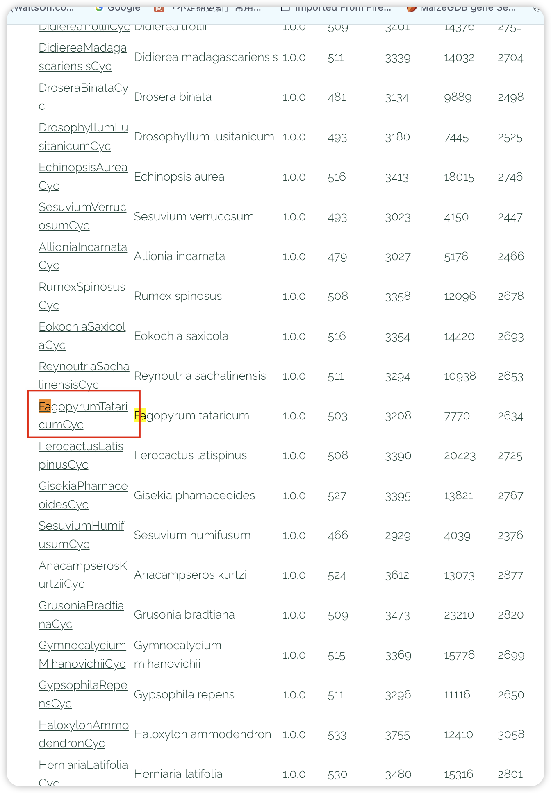
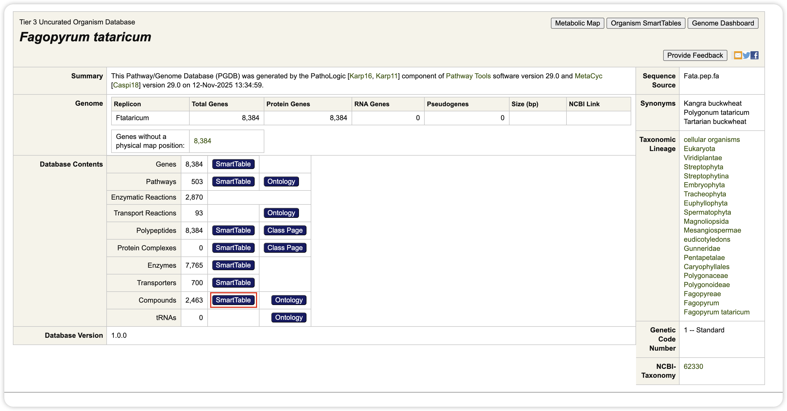
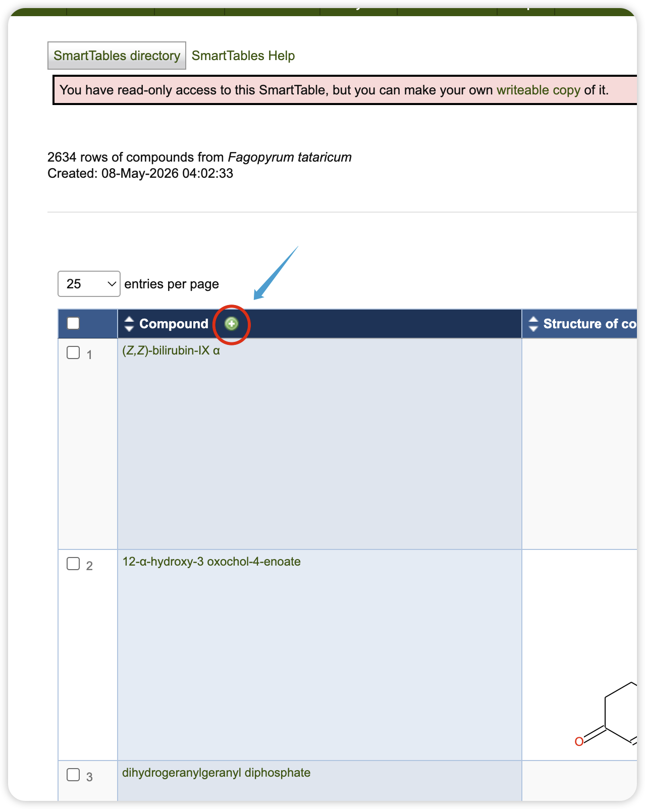
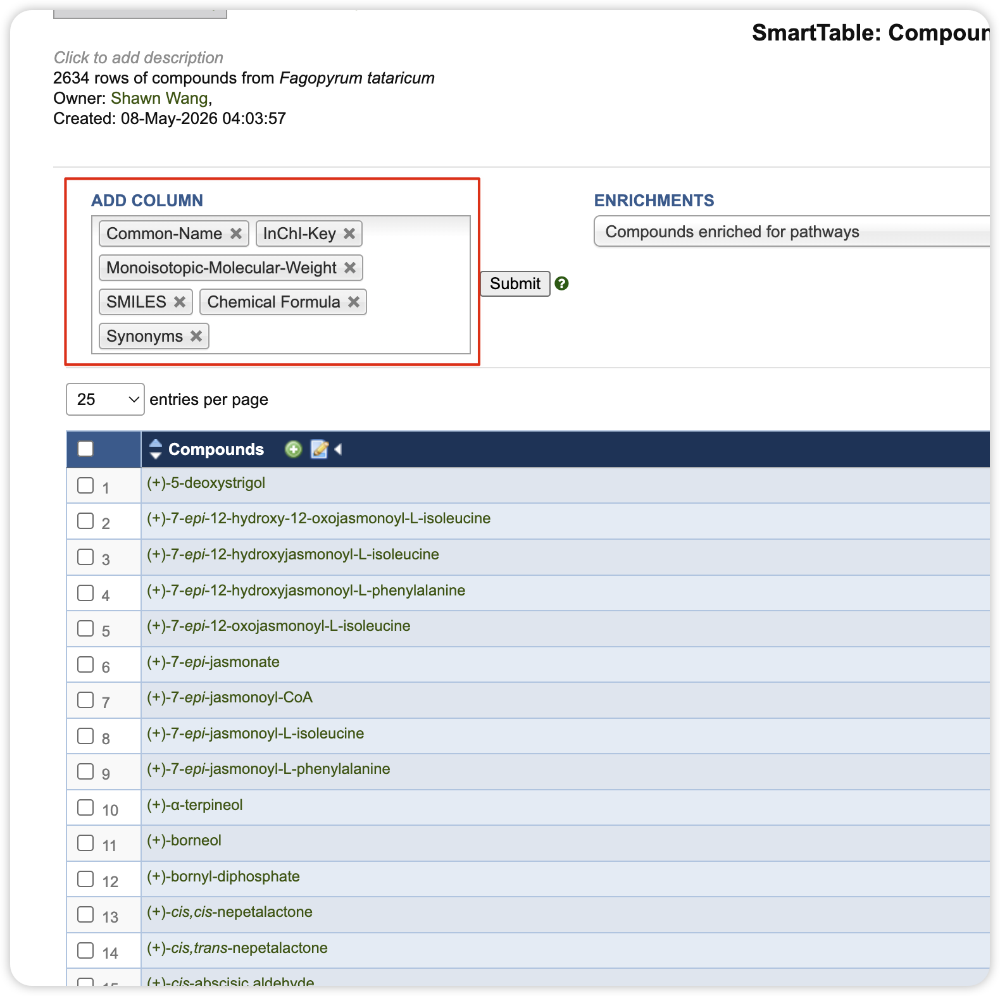
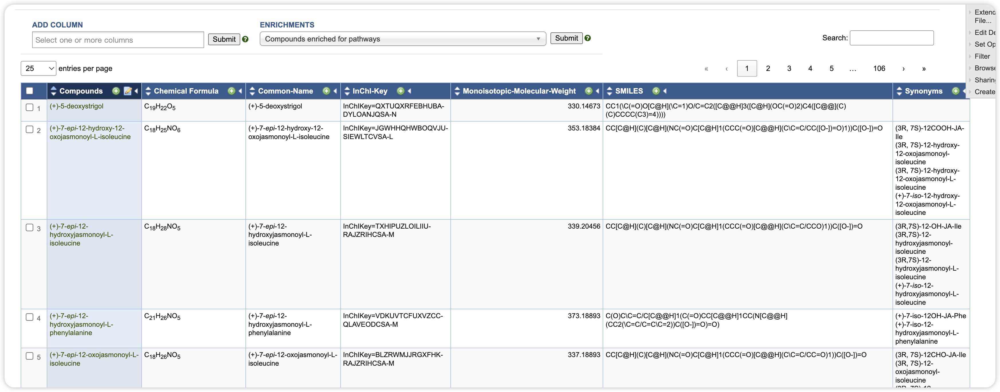
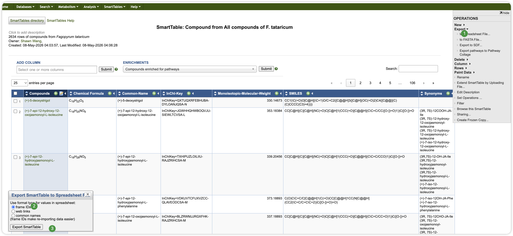

# PlantCyc Metabolite Database Construction

This toolkit builds species-specific metabolite annotation databases for MetMiner and metID from PlantCyc SmartTable exports. It is designed for workflows where a PlantCyc PGDB contains the species of interest, such as *Fagopyrum tataricum*.

## What You Need From PlantCyc

Open the PlantCyc PGDB list:

<https://plantcyc.org/list-of-pgdbs-2/>

Find the target species database and use PlantCyc SmartTables to export two tab-delimited text files.

After opening the species PGDB, use the SmartTable buttons in the organism database page. For *Fagopyrum tataricum*, the compound SmartTable can be opened from the `Compounds` row in the database contents table.

## File 1: Compound SmartTable

Export compound-level metabolite information. In the compound SmartTable, add the columns needed by MetMiner before exporting.

The table should contain these columns:

- `Compounds`
- `Chemical Formula`
- `Monoisotopic-Molecular-Weight`
- `InChI-Key`
- `SMILES`
- `Synonyms`
- `Common-Name`

Before exporting, quickly check that these columns are visible in the SmartTable.

This file is used to build the PlantCyc MS1 database. The `Compounds` column becomes the database `Lab.ID`, which is also used later for pathway enrichment.

## File 2: Pathway SmartTable

Export all pathways for the same species PGDB. From the organism database page, open the SmartTable from the `Pathways` row and export it as a spreadsheet file.

The pathway table should contain these columns:

- `Pathways`
- `Object ID`
- `Compounds of pathway`
- `Reactions of pathway`

This file is used to build the pathway-compound background after the compound table has been cleaned.

To prepare the pathway table:

1. Return to the species PGDB summary page.
2. In the `Database Contents` section, click the `SmartTable` button in the `Pathways` row.
3. In the pathway SmartTable, add `Object ID`, `Compounds of pathway`, and `Reactions of pathway`.
4. Confirm that the final table contains `Pathways`, `Object ID`, `Compounds of pathway`, and `Reactions of pathway`.
5. Export the pathway SmartTable as a spreadsheet file using the same export settings described below.

If you save pathway screenshots for this guide, use these filenames:

- `www/plantcyc/07_open_pathway_smarttable.png`
- `www/plantcyc/08_select_pathway_columns.png`
- `www/plantcyc/09_export_pathway_smarttable.png`

## Export Settings

For both SmartTables, use the right-side `Export` menu and choose `to Spreadsheet File...`.

When PlantCyc asks for the value format, select `frame IDs`. Then click `Export SmartTable`.

The exported files can be uploaded directly into this toolkit. Text, TSV, and tab-delimited SmartTable exports are supported.

## What The Toolkit Does

The workflow performs four major steps:

1. Clean PlantCyc compound and pathway tables.
2. Build a PlantCyc MS1-only `metid::databaseClass` object.
3. Search `massdbbuildin` public MS2 databases for spectra matching PlantCyc compounds.
4. Build a PlantCyc-linked MS2 `metid::databaseClass` object.

## Compound Cleaning Rules

The compound table is cleaned before database construction. By default, the toolkit removes:

- records missing chemical formula or monoisotopic molecular weight;
- compounds outside the LC-MS-friendly molecular-weight range;
- inorganic ions, metal ions, water, gases, and common currency metabolites;
- CoA-related compounds from the MS1-only library;
- carrier-bound, polymer-bound, or macromolecule-like entries;
- reactive or transient small molecules;
- HTML tags and escaped characters in names.

The default mass range is 70-1500 Da. You can adjust this range in the sidebar.

## MS1 Database

The MS1 database contains every retained PlantCyc compound. Important fields are mapped as follows:

- `Lab.ID`: PlantCyc compound ID
- `BIOCYC.ID`: PlantCyc compound ID
- `Compound.name`: PlantCyc common name
- `mz`: monoisotopic molecular weight
- `Formula`: chemical formula
- `INCHIKEY.ID`: InChIKey
- `SMILES.ID`: SMILES
- `RT`: `NA`

Because PlantCyc does not provide LC-specific retention time or experimental MS2 spectra in these SmartTables, this database is used for MS1/adduct-based annotation.

CoA and acyl-CoA derivatives are intentionally excluded from this MS1-only database. They have high molecular weights, complex adduct behavior, possible multiple-charge ions, and a high false-positive risk when annotation is based only on precursor mass.

## MS2 Database

The MS2 database is built by extracting public spectra from `massdbbuildin`:

- HMDB MS2
- MassBank MS2
- MoNA MS2

Public spectra are linked to PlantCyc compounds using conservative matching:

1. exact InChIKey match;
2. exact SMILES match plus formula and mass validation;
3. normalized compound name or synonym match plus formula and mass validation.

Formula-plus-mass alone is not used as an independent match because it is too ambiguous for metabolite annotation.

CoA and acyl-CoA derivatives are retained as MS2-eligible candidates. A CoA-related annotation should be accepted only when the precursor mass is supported by MS/MS evidence, especially characteristic CoA backbone fragments. The toolkit also writes `plantcyc_coa_fragment_rules.tsv` as a diagnostic-fragment rule table for downstream review.

The final MS2 database keeps PlantCyc IDs as the annotation key:

- `Lab.ID`: PlantCyc compound ID
- `BIOCYC.ID`: PlantCyc compound ID

This is important because downstream pathway enrichment uses the PlantCyc ID system.

## Output Files

The toolkit writes these files to the selected output folder:

- `plantcyc_ftataricum_ms1.rda`
- `plantcyc_ftataricum_ms2.rda`
- `plantcyc_ftataricum_pathway.rda`
- `plantcyc_ms1_spectra_info.tsv`
- `plantcyc_ms2_eligible_compounds.tsv`
- `plantcyc_ms2_spectra_info.tsv`
- `plantcyc_ms2_match_log.tsv`
- `plantcyc_ms2_unmatched_compounds.tsv`
- `plantcyc_coa_fragment_rules.tsv`
- `plantcyc_pathway_reaction_table.tsv`
- `plantcyc_database_summary.tsv`

The MS1 and MS2 `.rda` files can be used as local metID databases in the MetMiner annotation module. The pathway `.rda` file is a `metpath::pathway_database` object for pathway enrichment using PlantCyc compound IDs.

## Recommended Review

After construction, check the `Summary` and `MS2 Match Log` tabs:

- confirm how many PlantCyc compounds remain in the MS1 database;
- confirm how many compounds received public MS2 spectra;
- inspect the number of matches from HMDB, MassBank, and MoNA;
- review name-based matches more carefully than InChIKey-based matches.

InChIKey matches are the most reliable. Name-based matches are useful but should be treated as lower-confidence links.
